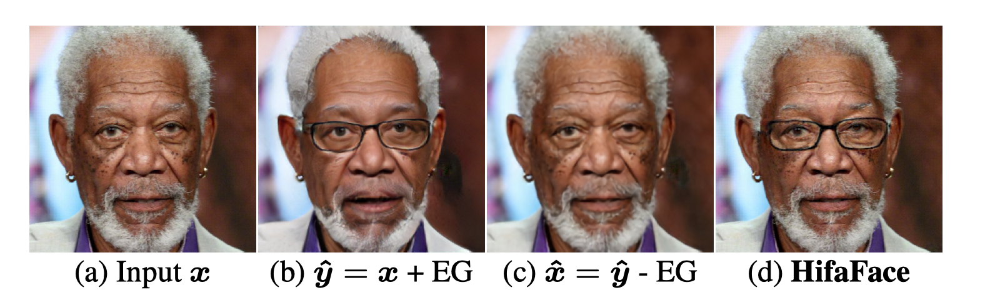
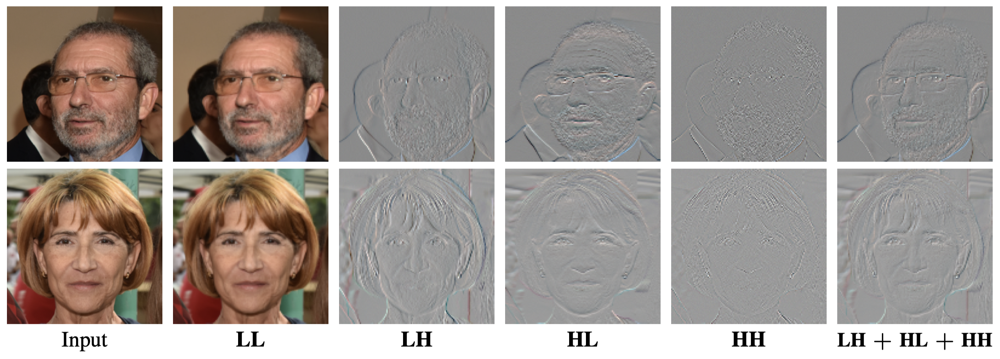
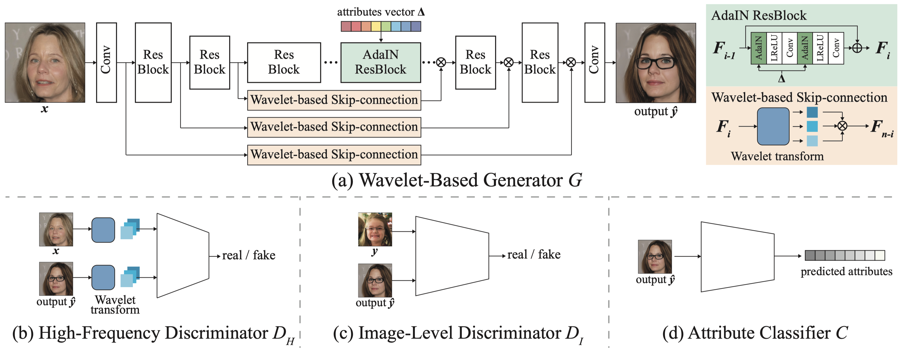

# HifaFace

## Introduction
This is the project site of the **High-Fidelity and Arbitrary Face Editing**.



Paper: [arXiv](https://arxiv.org/abs/2103.15814)   
Dataset: [CelebaHQ](https://github.com/tkarras/progressive_growing_of_gans) | [FFHQ](https://github.com/NVlabs/ffhq-dataset)   

## Abstract
Cycle consistency is widely used for face editing. However, we observe that the generator tends to find a tricky way to hide information from the original image to satisfy the constraint of cycle consistency, making it impossible to maintain the rich details (e.g., wrinkles and moles) of non-editing areas. In this work, we propose a simple yet effective method named HifaFace to address the above-mentioned problem from two perspectives. First, we relieve the pressure of the generator to synthesize rich details by directly feeding the high-frequency information of the input image into the end of the generator. Second, we adopt an additional discriminator to encourage the generator to synthesize rich details. Specifically, we apply wavelet transformation to transform the image into multi-frequency domains, among which the high-frequency parts can be used to recover the rich details. We also notice that a fine-grained and wider-range control for the attribute is of great importance for face editing. To achieve this goal, we propose a novel attribute regression loss. Powered by the proposed framework, we achieve high-fidelity and arbitrary face editing, outperforming other state-of-the-art approaches.


## Intuition
Cycle consistency in CycleGANs causes steganography. The key idea of our method is to adopt a wavelet-based generator and a high-frequency discriminator.




## Model Architecture



## Main Results
### Attribute-Based Face Editing


### Arbitrary Face Editing


## Citation
If you find our work is helpful, please consider citing our work:
```
@inproceedings{gao2021hifaface,
  title={High-Fidelity and Arbitrary Face Editing},
  author={Gao, Yue and Wei, Fangyun and Bao, Jianmin and Gu, 
          Shuyang and Chen, Dong and Wen, Fang and Lian, Zhouhui},
  booktitle={Proceedings of the IEEE Conference on Computer Vision and Pattern Recognition},
  year={2021}
}
```
